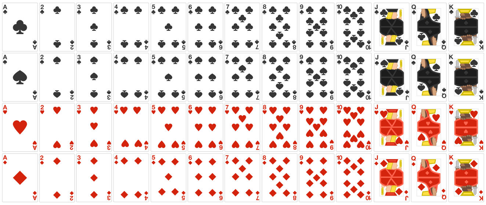
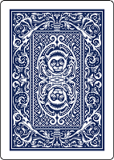

# french card deck:
## categories (category):
☘ clover/klee

🛡 pike/spitze

❤ heart/herz

⬛ tile/kachel

## card types (type):
A, 2, 3, 4, 5, 6, 7, 8, 9, 10, J, Q, K

### 2:
always playable, 

stack value 2

### 3:
always playable,

value of card underneath counts

### 7:
only playable on cards higher or equal 7,

next card has to be lower than or 7

### 8:
cut out the next player (next 2 if 2x 8, next 3 if 3x 8)

### 10:
clear stack,

play again

### 4 of a kind:
clear stack, 

play again

## classes:
### player
- handCards[]
- tableCards[{
 top: card,
 bottom: card
}]

### shithead
- cardWidth
- cardHeight
- cardImagePath
- cardbackImagePath
+ playCard(stackCardValue, stackCardCount) : bool

### card : shithead
- category
- type
+ getCardImage() : {x, y, cardWidth, cardHeight}
+ playCard(stackCardValue, stackCardCount) : bool

