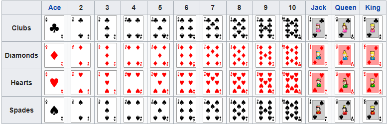

# card
Card Images from [here](http://acbl.mybigcommerce.com/52-playing-cards/).

## suits (categories)
* ♣ club/klee
* ♦ diamond/karo
* ♥ heart/herz
* ♠ spade/pik

## ranks (types/values)
2, 3, 4, 5, 6, 7, 8, 9, 10, J, Q, K, A

## rules
### 2
always playable, stack value reset to 2

### 3
always playable, value of card underneath counts

### 7
only playable on cards higher or equal 7, next card has to be lower than or 7

### 8
cut out the next player (next 2 if 2x 8, next 3 if 3x 8)

### 10
clear stack, play again

### 4 cards of a rank
clear stack, play again
